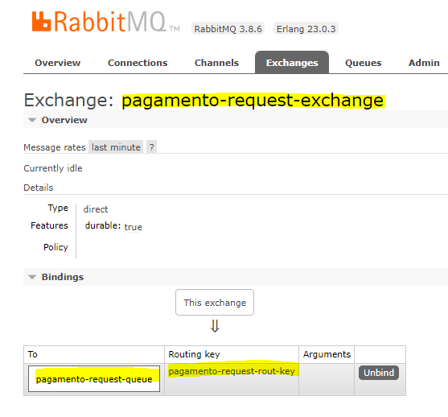

# master-dev-spring-rabbit-docker
Tutorial: Spring Boot 3 + RabbitMQ + Docker do canal Master Dev

https://www.youtube.com/watch?v=weAruTI623k

### Para rodar o projeto:
* No terminal rodar: cd .\demo-backend-worker\docker\
* Então rodar no o docker-compose up.
* Acessar http://localhost:15672/ e criar as configurações de Queue, Exchange e Binding, conforme explicado am anotações.
* Rodar ambas as aplicações.
* Realizar um método POST para http://localhost:8080/api/v1/pagamentos com o seguinte payload:
* ```
  {
    "numeroPedido": "3",
    "valor": 4000,
    "produto": "Playstation 5"
  }
* Acompanhar pelos logs ou pela aba Queues no RabbitMQ.

### Anotações:
* Foram criados dois projetos através do https://start.spring.io, sendo:
  * Api: Spring Web e Spring for RabbitMQ.
  * Worker: Spring for RabbitMQ
* Foram alteradas as portas dos projetos para não ocorrer conflito quando rodarmos, ficando:
  * Api: 8080
  * Worker: 9090.
* Dentro do Worker, criado o docker-compose para rodar o rabbitmq.
* Rodar docker-compose up.
* Acessar http://localhost:15672/ (porta padrão pro admin e outra diferente para a aplicação):
  * Login: guest
  * Password: guest
* Sobre o Rabbit:
  * Quando uma mensagem é produzida, ela chega através de uma Exchange dentro do Broker do RabbitMQ.
  * A Exchange é responsável por direcionar, através dos Bindings/Routing Keys, as mensagens para as Queues.
  * E o Consumer ficará ouvindo essas Queues para pegar as mensagens que chegarem.
* Dentro de http://localhost:15672/#/queues criaremos as 3 Queues, sendo elas:
  * A de request: pagamento-request-queue
  * A de response error: pagamento-response-error-queue
  * E a de response success: pagamento-response-success-queue
* Dentro de http://localhost:15672/#/exchanges criaremos 3 as Exchanges abaixo e em seguida faremos um Binding:
  * pagamento-request-exchange
  * pagamento-response-error-exchange
  * pagamento-response-success-exchange
* Após criadas as 3 Exchanges, entraremos em cada uma dela e realizaremos a Binding, entre:
  * pagamento-request-exchange -> pagamento-request-queue com routing key pagamento-request-rout-key:
  * 
  * pagamento-response-error-exchange -> pagamento-response-error-queue e pagamento-response-error-rout-key.
  * pagamento-response-success-exchange -> pagamento-response-success-queue e pagamento-response-success-rout-key.
* No projeto [demo-backend-api](demo-backend-api):
  * Dentro da classe principal, adicionamos a anotação para informar que o Rabbit será usado nessa aplicação.
  * Criaremos as classes de Controller e Service com suas implementações.
  * E a Producer com a injeção de dependência do AmqpTemplate com o médoto convertAndSend.
  * Para verificarmos a mensagem, podemos ir na aba Queues > Message e dar um Get Message.
  * Voltando no API, criaremos dois Consumers, um de Sucesso e outro de Erro para consumir as mensagens enviadas pelo Worker.
  * E também dois métodos novos na Service para tratar as mensagens de retorno, seja de Erro ou de Sucesso.
* No projeto [demo-backend-worker](demo-backend-worker):
  * Dentro da classe principal, adicionamos a anotação para informar que o Rabbit será usado nessa aplicação.
  * Criamos a classe de Consumer, para consumir as mensagens publicadas dentro da fila pagamento-request-queue e printamos a mesma. Esse é o cenário bonito.
  * Criaremos mais duas classes, uma de Producer de Sucesso e outra de Producer de Erro e implementaremos uma Random de boolean para realizar essa postagem nas suas respectiva filas.
  * Voltar no api.